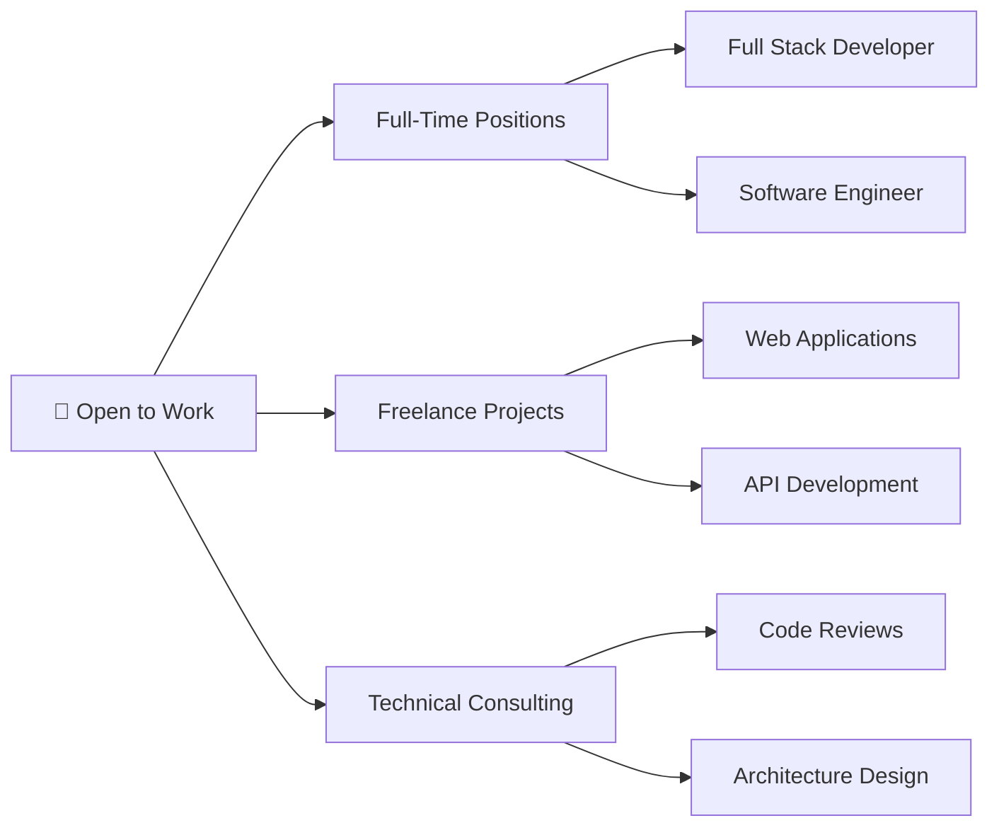

<!-- Professional Header -->
<div align="center">
  
</div>

<!-- Professional Title with Animation -->
<h1 align="center">
  <a href="https://git.io/typing-svg">
    
  </a>
</h1>

<!-- Professional Badges -->
<p align="center">
  <a href="https://portfolio-yosr.vercel.app/">
    
  </a>
  <a href="https://linkedin.com/in/yosrbennagra">
    
  </a>
  <a href="mailto:yosr.bennagra@gmail.com">
    
  </a>
  
</p>

<br/>

---

<!-- Professional Summary -->


## 👨‍💻 Professional Summary

**Software Engineer** with expertise in **Full Stack Development**, passionate about building scalable and user-centric applications. Proficient in modern frameworks and cloud technologies with a proven track record of delivering high-quality solutions.

### 🎯 Core Competencies
- ✅ **Full Stack Development** (Frontend + Backend + DevOps)
- ✅ **Modern Web Frameworks** (Next.js, React, Angular)
- ✅ **Enterprise Solutions** (.NET, Spring Boot, NestJS)
- ✅ **Cloud & DevOps** (Docker, CI/CD, Microservices)
- ✅ **Database Design** (SQL & NoSQL)
- ✅ **Agile Methodologies** & Team Collaboration

### 🌟 Current Focus
```javascript
const currentStatus = {
  role: "Full Stack Software Engineer",
  location: "Tunisia 🇹🇳",
  openToWork: true,
  interests: ["Web3", "Cloud Native", "AI/ML Integration"],
  currentlyBuilding: "Innovative Full Stack Solutions",
  availableFor: ["Full-time Roles", "Freelance Projects", "Technical Consulting"],
  languages: ["English", "French", "Arabic"]
};
```

<br clear="both"/>

---

<!-- Professional Tech Stack -->
## 💼 Technical Expertise

<table align="center">
<tr>
<td align="center" width="50%">

### 🎨 Frontend Development
<p>
  
  
  
  
  
  
  
</p>

</td>
<td align="center" width="50%">

### ⚙️ Backend Development
<p>
  
  
  
  
  
  
  
</p>

</td>
</tr>

<tr>
<td align="center" width="50%">

### 🗄️ Database & Tools
<p>
  
  
  
  
</p>

</td>
<td align="center" width="50%">

### 🚀 DevOps & Cloud
<p>
  
  
  
  
  
</p>

</td>
</tr>
</table>

<div align="center">
  
</div>

---

<!-- GitHub Performance Metrics -->
## 📊 GitHub Performance & Analytics

<div align="center">
   
  
</div>

<div align="center">
  
  
</div>

<!-- Professional Activity Visualization -->
<details open>
<summary><b>📈 Detailed Contribution Analytics</b></summary>
<br/>

<div align="center">
  
</div>

<div align="center">
  
</div>

</details>

<!-- Snake Animation -->
<details>
<summary><b>🐍 Contribution Snake Animation</b></summary>
<br/>

<div align="center">
  <picture>
    <source media="(prefers-color-scheme: dark)" srcset="https://raw.githubusercontent.com/YosrBennagra/YosrBennagra/output/github-contribution-grid-snake-dark.svg" />
    <source media="(prefers-color-scheme: light)" srcset="https://raw.githubusercontent.com/YosrBennagra/YosrBennagra/output/github-contribution-grid-snake.svg" />
    
  </picture>
</div>

</details>

---

<!-- Featured Projects with Descriptions -->
## 🚀 Featured Projects & Portfolio Highlights

<table>
<tr>
<td width="50%">

### 🌐 [Modern Portfolio Website](https://github.com/YosrBennagra/Portfolio_Yosr)
[](https://github.com/YosrBennagra/Portfolio_Yosr)

**Tech:** Next.js 14 • TypeScript • Tailwind CSS • Framer Motion

Multilingual portfolio with dark/light themes, smooth animations, and modern UI/UX design.

🔗 [Live Demo](https://portfolio-yosr.vercel.app/)

</td>
<td width="50%">

### 🏥 [Smart E-Health Platform](https://github.com/YosrBennagra/PFE_ITserv_Smart_EHealth_App)
[](https://github.com/YosrBennagra/PFE_ITserv_Smart_EHealth_App)

**Tech:** React • Node.js • MongoDB • Express

Comprehensive healthcare management system for medical professionals and patients.

</td>
</tr>

<tr>
<td width="50%">

### 🎯 [3SC Application](https://github.com/YosrBennagra/3SC)
[](https://github.com/YosrBennagra/3SC)

**Tech:** C# • .NET • WPF

Enterprise-grade desktop application with modern architecture.

</td>
<td width="50%">

### ⚡ [NestJS Backend Project](https://github.com/YosrBennagra/Stage-nestjs)
[](https://github.com/YosrBennagra/Stage-nestjs)

**Tech:** NestJS • TypeScript • PostgreSQL

RESTful API with authentication, validation, and database integration.

</td>
</tr>
</table>

<div align="center">
  
[](https://github.com/YosrBennagra?tab=repositories)

</div>

---

<!-- Achievements & Recognition -->
## 🏆 Achievements & Recognition

<div align="center">
  
</div>

<div align="center">
  
| 🎯 Metric | 📊 Value |
|-----------|----------|
| **Total Repositories** | 31+ Projects |
| **Primary Languages** | TypeScript, C#, JavaScript, Java |
| **Contributions** | Active Daily Contributor |
| **Collaboration** | Open Source Enthusiast |

</div>

---

<!-- Professional CTA -->
## 💼 Open to Opportunities

<div align="center">



</div>

<table align="center">
<tr>
<td align="center" width="33%">

### 🎯 What I Bring
- Modern web solutions
- Clean, maintainable code
- Agile mindset
- Team collaboration
- Problem-solving skills

</td>
<td align="center" width="33%">

### 💡 Seeking Roles In
- Full Stack Development
- Frontend Engineering
- Backend Development
- Software Engineering
- DevOps Engineering

</td>
<td align="center" width="33%">

### 🌍 Work Preferences
- Remote-friendly
- International teams
- Innovative projects
- Growth opportunities
- Tech-forward companies

</td>
</tr>
</table>

---

<!-- Contact & Connect -->
## 📬 Let's Connect & Collaborate

<div align="center">

### 🤝 Reach Out to Discuss Opportunities

<p>
  <a href="mailto:yosr.bennagra@gmail.com">
    
  </a>
</p>

<p>
  <a href="https://linkedin.com/in/yosrbennagra">
    
  </a>
  <a href="https://portfolio-yosr.vercel.app/">
    
  </a>
  <a href="https://github.com/YosrBennagra">
    
  </a>
</p>

<p>
  <a href="https://twitter.com/YosrBennagra">
    
  </a>
  <a href="https://dev.to/yosrbennagra">
    
  </a>
</p>

### 📊 Response Time: Within 24 Hours

</div>

---

<!-- Inspirational Quote -->
<div align="center">
  
</div>

---

<!-- Support Section -->
<div align="center">

### ⭐ If You Find My Work Valuable

**Support my open-source contributions by:**
- ⭐ Starring repositories you find useful
- 🔄 Sharing projects with your network  
- 🤝 Collaborating on interesting projects
- 💬 Providing feedback and suggestions

</div>

---

<!-- Footer -->
<div align="center">
  
**💼 Currently:** Building Innovative Solutions | **🌟 Looking for:** Exciting Opportunities | **📍 Based in:** Tunisia


<p>
  <i>⚡ "Passionate about creating impactful software that makes a difference" ⚡</i>
  <br/><br/>
  
</p>

</div>

