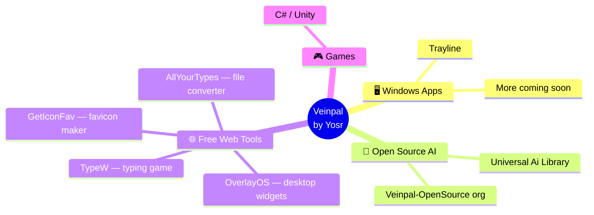

# Hi, I'm Yosr 👋

I'm a solo developer with big ambitions — I build **Windows apps, games, and tools** under the [**Veinpal**](https://www.veinpal.com/) label, and everything connects.

Here's the map of what I'm building:

<table>
<tr>
<td width="50%" valign="top">

### 🖥️ Desktop & Games

The core of Veinpal: polished Windows software and Unity games.

- [**Trayline**](https://www.veinpal.com/apps/trayline) — desktop utility, live now
- More apps & games in the forge 🔨

</td>
<td width="50%" valign="top">

### 🤖 Open-Source AI Tools

Built in the open at [Veinpal-OpenSource](https://github.com/Veinpal-OpenSource).

- [**Universal Ai Library**](https://uail.veinpal.com/) — production-grade AI agent skills

</td>
</tr>
<tr>
<td width="50%" valign="top">

### 🌐 Free Web Tools

No paywalls, runs in your browser.

- [**OverlayOS**](https://overlayos.veinpal.com/) — desktop widgets & drawers
- [**AllYourTypes**](https://allurtypes.veinpal.com) — file converter ([src](https://github.com/YosrBennagra/AllYourTypes))
- [**GetIconFav**](https://gifav.veinpal.com) — favicon generator ([src](https://github.com/YosrBennagra/GetIconFav))
- [**TypeW**](https://typew.veinpal.com) — typing speed game

</td>
<td width="50%" valign="top">

### 🧰 How I build

- **C# / Unity** for desktop & games
- **TypeScript / React** for the web
- One person, end to end: idea → design → ship

📘 [Veinpal Ecosystem Overview](./docs/veinpal-ecosystem-overview.md)

</td>
</tr>
</table>

---

### 🔗 Connect

  
  
  
  
  
  
  

<i>"Each day is better than yesterday. Always learning, always building."</i>

